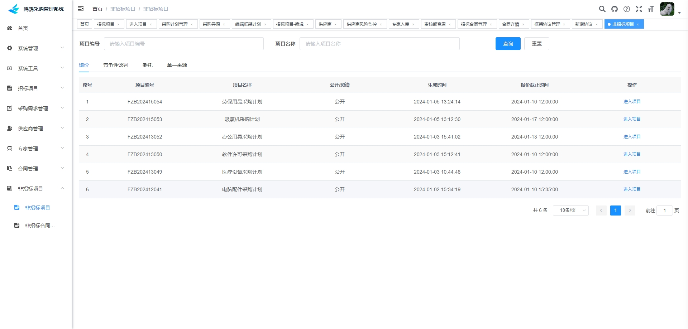
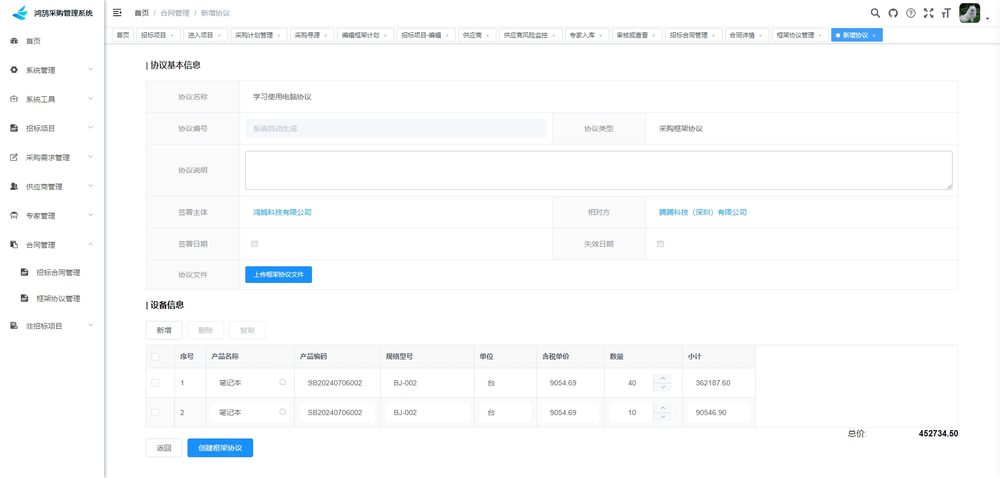

	

<h1 align="center" style="margin: 30px 0 30px; font-weight: bold;">HongHu v1.0.1</h1>
<h4 align="center">基于 Vue/Element UI 和 Spring Boot/Spring Cloud & Alibaba 前后端分离的分布式微服务架构</h4>

	
	

## 平台简介

鸿鹄采购管理系统是一套全部开源的快速开发平台，毫无保留给个人及企业免费使用。

* 采用前后端分离的模式，基于ruoyi-cloud。
* 后端采用Spring Boot、Spring Cloud & Alibaba。
* 注册中心、配置中心选型Nacos，权限认证使用Redis。
* 流量控制框架选型Sentinel，分布式事务选型Seata。
* 提供了技术栈（[Vue3](https://v3.cn.vuejs.org) [Element Plus](https://element-plus.org/zh-CN) [Vite](https://cn.vitejs.dev)）版本[RuoYi-Cloud-Vue3](https://github.com/yangzongzhuan/RuoYi-Cloud-Vue3)，保持同步更新。
* 如需不分离应用，请移步 [RuoYi](https://gitee.com/y_project/RuoYi)，如需分离应用，请移步 [RuoYi-Vue](https://gitee.com/y_project/RuoYi-Vue)
* 阿里云折扣场：[点我进入](http://aly.ruoyi.vip)，腾讯云秒杀场：[点我进入](http://txy.ruoyi.vip)&nbsp;&nbsp;
* 阿里云优惠券：[点我领取](https://www.aliyun.com/minisite/goods?userCode=brki8iof&share_source=copy_link)，腾讯云优惠券：[点我领取](https://cloud.tencent.com/redirect.php?redirect=1025&cps_key=198c8df2ed259157187173bc7f4f32fd&from=console)&nbsp;

## 系统模块

~~~
├── honghu-bidding-ui     // 鸿鹄招投标平台前端 [81]
├── ruoyi-ui              // 前端框架 [80]
├── ruoyi-gateway         // 网关模块 [8080]
├── ruoyi-auth            // 认证中心 [9200]
├── ruoyi-api             // 接口模块
│       └── ruoyi-api-system                          // 系统接口
├── ruoyi-common          // 通用模块
│       └── ruoyi-common-core                         // 核心模块
│       └── ruoyi-common-datascope                    // 权限范围
│       └── ruoyi-common-datasource                   // 多数据源
│       └── ruoyi-common-log                          // 日志记录
│       └── ruoyi-common-redis                        // 缓存服务
│       └── ruoyi-common-seata                        // 分布式事务
│       └── ruoyi-common-security                     // 安全模块
│       └── ruoyi-common-swagger                      // 系统接口
├── ruoyi-modules         // 业务模块
│       └── ruoyi-system                              // 系统模块 [9201]
│       └── ruoyi-gen                                 // 代码生成 [9202]
│       └── ruoyi-job                                 // 定时任务 [9203]
│       └── ruoyi-file                                // 文件服务 [9610]
|		└── hh-basic								  // 基础资料 [9999]
|		└── hh-bidding								  // 招标模块 [9209]
|		└── hh-nobidding							  // 非招标模块 [9211]
|		└── hh-procure							      // 采购模块 [9230]
├── ruoyi-visual          // 图形化管理模块
│       └── ruoyi-visual-monitor                      // 监控中心 [9100]
├──pom.xml                // 公共依赖
~~~

## 架构图

## 内置功能（除若依功能以外）

1.  采购需求管理：进行采购计划的编写、修改、删除、审核的流程。
2.  编码规则：可以自定义编码规则。
3.  采购寻源：对已审核的采购计划寻找资源，生成招标项目。
4.  框架规则：对信任的供应商签订框架协议，可直接采购。
5.  专家管理：需要参加评审的专家可以对其审核。
6.  供应商：可以对在招投标平台注册的供应商进行管理。
7.  合同管理：可以对定标的计划进行合同的签订存档。
8.  非招标项目：对审核通过的非招标项目可以进行对应的采购方式采购。
9.  招标项目：审核通过的采购计划可以进行招标、投标、投标、开标、评标等信息记录。

## 招投标平台 

本项目不仅提供了采购管理系统，还提供了招投标平台（honghu-bidding-ui）

1.  注册：供应商注册后会显示在采购系统当中。
2.  投标：已经注册的供应商可以进行投标，然后在管理系统中进行开标、评标。

## 演示图

<table>
    <tr>
        <td></td>
        <td></td>
    </tr>
    <tr>
        <td></td>
        <td></td>
    </tr>
    <tr>
        <td></td>
        <td></td>
    </tr>
	<tr>
        <td></td>
        <td></td>
    </tr>	 
    <tr>
        <td></td>
        <td></td>
    </tr>
	<tr>
        <td></td>
        <td></td>
    </tr>
	<tr>
        <td></td>
        <td></td>
    </tr>
	<tr>
        <td></td>
        <td></td>
    </tr>
    <tr>
        <td></td>
        <td></td>
    </tr>
</table>

## 联系方式 

    
    

